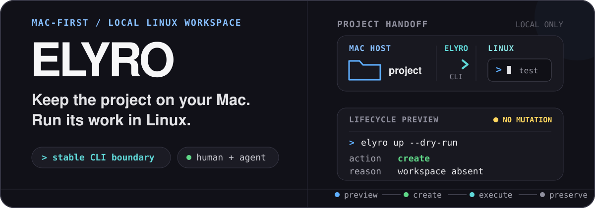

<p align="center">
  
</p>

<p align="center">
  <a href="https://github.com/cofy-x/elyro/releases"></a>
  <a href="https://github.com/cofy-x/elyro/actions/workflows/ci.yml"></a>
  <a href="LICENSE"></a>
</p>

Elyro is a Mac-first, local-first Linux Workspace for individual developers and host coding agents. Source files and editing stay on macOS; build, test, and debug commands run in a maintained local container through one small, stable CLI.

<p align="center">
  <a href="docs/installation.md"><strong>Install</strong></a> ·
  <a href="docs/workspace/README.md">Workspace guide</a> ·
  <a href="docs/coding-agents.md">Coding agents</a> ·
  <a href="docs/why-elyro.md">Why Elyro</a> ·
  <a href="docs/roadmap.md">Roadmap</a>
</p>

## See the lifecycle before it changes anything


_This is a real local Workspace recording, not mocked output. Elyro previews the plan, creates the Workspace, executes `uname -s` in Linux, previews removal, and then removes only Elyro-managed resources._

## Start with one Workspace

Install Elyro, enter a Go, Python, or Node.js project, and open it in VS Code or Cursor through managed Remote SSH:

```bash
brew install cofy-x/tap/elyro
elyro up --open
```

When exactly one Toolchain is detectable, Elyro selects it without writing project configuration. For an ambiguous or non-interactive project, choose explicitly:

```bash
elyro up --toolchain go --open
```

Docker is required. Elyro supports macOS and Linux on amd64 and arm64; VS Code or Cursor with Remote SSH is optional. See [Installation](docs/installation.md) for the release installer, `go install`, and Linux ownership notes.

The compatibility baseline begins at v0.1.5: the CLI, `elyro.yaml` version 1, JSON schemas, exit codes, and lifecycle meanings remain the stable contract for later pre-1.0 releases.

## A deliberately small boundary

- **Your Mac owns the project.** Source files, Git state, editing, and mounted host data stay on the host.
- **The Workspace owns Linux execution.** `exec` and `shell` use local Docker directly as the `elyro` user in the project mount.
- **Elyro owns the handoff.** It selects the image, plans lifecycle changes, manages the container and registry, and isolates Remote SSH trust from your global SSH configuration.

The daily loop stays inspectable:

```bash
elyro up --dry-run
elyro up
elyro exec -- go test ./...
elyro shell
elyro down --dry-run
elyro down
```

`up --dry-run` explains whether Elyro will `create`, `start`, `reuse`, or `recreate` a Workspace. `down --dry-run` lists what removal will affect. Recreating or removing a Workspace discards its container writable layer, while project files, mounted host data, and local images stay on the host.

Shell syntax is never guessed. Direct execution is argv-safe:

```bash
elyro exec -- go test ./...
elyro exec -- bash -lc 'go test ./... | tee /tmp/test.log'
```

## One CLI for people and coding agents

People get calm terminal receipts, useful next steps, a native Workspace prompt, and editor handoff with `elyro up --open`. Pipes, CI, and JSON stay stable and free of presentation noise.

Host coding agents use the same lifecycle and execution contract. Elyro does not install, authenticate, run, or proxy the agent:

```bash
elyro skill install codex
elyro skill install claude-code
# or: elyro skill install all
```

In a project that contains `elyro.yaml`, the bundled `use-elyro-workspace` Skill teaches an already installed agent to inspect status, preview mutations, and execute Linux commands through Elyro:

```bash
elyro status --json
elyro up --dry-run --json
elyro up --json
elyro exec -- go test ./...
```

The Skill contains guidance only—no scripts, credentials, model configuration, or direct Docker instructions. Read [Using Elyro with Coding Agents](docs/coding-agents.md) for its activation boundary and an `AGENTS.md` snippet.

## Add project state explicitly

Zero-config startup is the default. Reach for configuration only when the project needs to declare more:

- `elyro init` creates `elyro.yaml` for named Environments, ports, mounts, editor settings, platform selection, or a custom image.
- `elyro image init` creates a project-owned Dockerfile for persistent OS libraries, compilers, database clients, or global CLIs.
- `docker.environment` and `docker.env_files` provide explicit, non-secret runtime values to `exec`, `shell`, SSH, and editor terminals.

Project image builds are always explicit:

```bash
elyro image init
# edit .elyro/Dockerfile
elyro image build
elyro up --recreate
```

Ordinary `elyro up` never builds a Dockerfile or runs project lifecycle hooks. Elyro never reads `.env` implicitly, inherits arbitrary host variables, or presents Docker-visible runtime values as a secret store.

## Know the limits

An Elyro Workspace is a development environment, not a security sandbox. Elyro does not replace Docker's security model or the host coding agent's permission system. It intentionally does not provide remote Workspace orchestration, teams, multi-tenancy, enterprise policy, a package manager, background jobs, an agent runtime, Dev Container compatibility, or a web UI.

That narrow scope is the product: a predictable Mac-to-local-Linux workflow that remains easy to understand, inspect, and automate. Read [Why Elyro](docs/why-elyro.md) for the trade-offs and [Roadmap](docs/roadmap.md) for the current boundaries.

## Documentation

- [Installation](docs/installation.md) — platforms, requirements, and install methods
- [Workspace guide](docs/workspace/README.md) — lifecycle, execution, shell, and editor handoff
- [Workspace configuration](docs/workspace/configuration.md) — Environments, ports, mounts, runtime values, and images
- [CLI reference](docs/workspace/cli-reference.md) — commands, JSON contracts, and terminal behavior
- [Custom images](docs/workspace/custom-images.md) — project-owned Dockerfiles and explicit builds
- [Coding agents](docs/coding-agents.md) — Skill workflow and safety boundary
- [Supported images](images/README.md) — base, Python, Go, and Node.js Workspace images

## Development

```bash
go test ./...
make workspace-smoke
make workspace-e2e
make ci-pr-smoke
```

The terminal demo is generated from [`scripts/demo/elyro.tape`](scripts/demo/elyro.tape) with `make demo-record` and uses a real local Workspace. See [CONTRIBUTING.md](CONTRIBUTING.md) before sending a change, [SECURITY.md](SECURITY.md) for vulnerability reports, and [CODE_OF_CONDUCT.md](CODE_OF_CONDUCT.md) for community expectations.

Elyro is licensed under [Apache-2.0](LICENSE). Product names and trademarks belong to their respective owners; interoperability does not imply endorsement.
